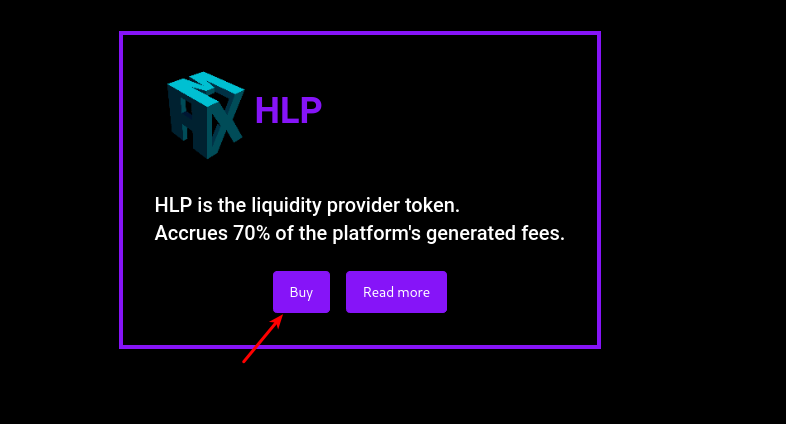
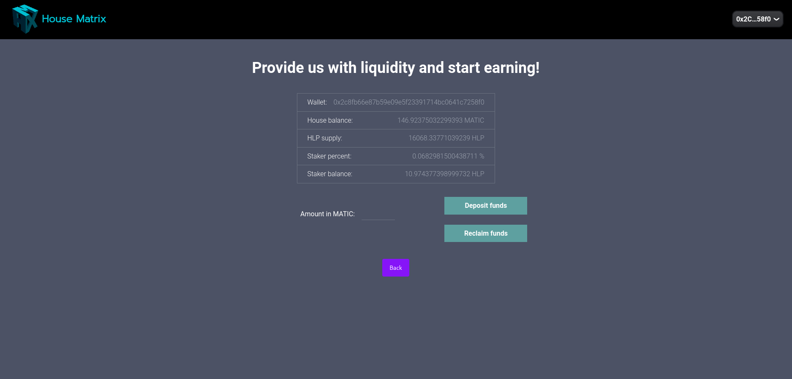

### Project description

Our project can be summarized as a decentralized Casino that allows everyone to either stake their money and provide liquidity for the house, or bet against it.

The stakers receive 70% of the revenue while the other 30% goes to the HMX token holder. This last token will act as a governance token and will symbolize decision power over the platform much like a DAO.

To avoid liquidity drops, when a staker claims back the deposited funds, they first go to the Vault for linear delayed liberation over 20 days.
As the funds get unstaked, the Stakers can claim them back to their wallets.

The wallet must be connected to MUMBAI testnet network.

#### Staking

Let's start with the staking. Once the frontend is launched as instructed below, we will scroll down to the section where you can buy some HLP, which is the equivalent of providing liquidity to the house. 
After staking some funds, we will be able to interact with them and check how the investment is doing in that same page. 
This number will change depending on how the roulette players do. If they lose, this number will go up and if they win, this number will go down

#### Betting

If staking looks boring to you, you can go against the house too! Follow the instructions below to run the housematrix roulette and deposit some funds to the cashier. Then, place your bets, click the spin button and thats it. Good luck!

### Run frontend on local machine

`cd reactCombineLandingPage`

`yarn `

`yarn start`

### Run roulette on local machine

`cd roulette`

`npm install `

`npm start`

### Vrf Subscription

https://vrf.chain.link/mumbai/2190

### Solidity File Structure

In our project we are using cutting edge technology like Ethereum Improvement Proposal:2535, which is called Diamond: Multi-Facet Proxy. We create a modular smart contract system that can be extended and updated after deployment without changing the main deployment address.

---

#### Utility facets
##### Facet : DiamondCutFacet

`diamondCut((address,uint8,bytes4[])[],address,bytes)` updates diamond

##### Facet : DiamondLoupeFacet

This facet is used to query diamond for actual facets and associated functions.

1. `facetAddress(bytes4)`
2. `facetAddresses()`
3. `facetFunctionSelectors(address)`
4. `facets()`
5. `supportsInterface(bytes4)`

##### Facet : OwnershipFacet

1. `owner()`
2. `transferOwnership(address)`

---

#### Functional facets
##### Facet : PlayersFacet

1. `checkPlayerBalance()`
2. `depositToCashier()`
3. `withdrawPlayerBalance()`
4. `withdrawPlayerBalanceAmount(uint256)`

##### Facet : StakerFacet

1. `checkStakerBalance()`
2. `getHLPTokenAddress()`
3. `reclaimHLP(uint256)`
4. `setHLPTokenAddress(address)`
5. `stakeETH()`

##### Facet : AdminFacet

1. `checkPlatformBalance()`
2. `isContractOwner()`
3. `withdrawAllPlatformFunds()`

##### Facet : RouletteFacet
Controls the gamve and VRF repsonses.

1. `getReqID()`
2. `getRnd()`
3. `placeBet((uint256,uint8,uint8)[],uint256)`
4. `rawFulfillRandomWords(uint256,uint256[])`
5. `testFulfillRandomWords(uint256,uint256[])`
6. `testGetAmounts()`

##### Facet : VaultFacet
Used to control reclaiming and redeeming staked funds.

1. `getVaultState()`
2. `redeemFromVault()`

### Running tests

###### Test Staker

`npx hardhat test test/testStaker.js`

###### Test Player

`npx hardhat test test/testPlayer.js`

###### Test Diamond

`npx hardhat test test/testDiamond.js`

### Deployment to MUMBAI

###### Deploy HLP Token

`yarn hardhat run deploy/deployHLP.js --network mumbai`

###### Deploy Staker

`yarn hardhat run deploy/deployStaker.js --network mumbai`

###### Deploy diamond

Deploy HLP first
`yarn hardhat run deploy/deploy.js --network mumbai`

###### Cut diamond: update a module

`yarn hardhat run deploy/Cut.js --network mumbai`
The script shpuld be adjsuted in accordance to what module we want to update.

### Run minimal frontend used for testing

`cd frontend`
`npm run start`

yarn hardhat run test/deployHLP.js
